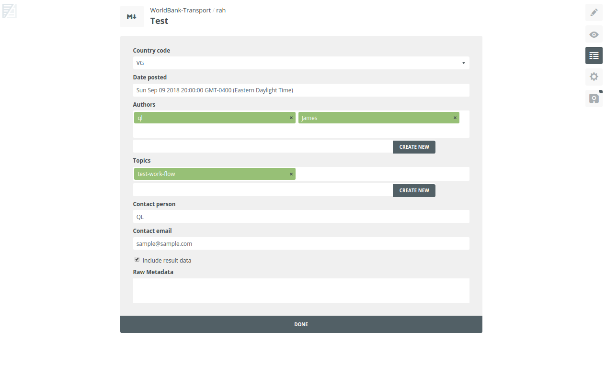

## Editing content
Content that is already published on RAH can be edited through Prose, an easy to use content editor for content stored on Github.

## 1. Go to Prose
Go to Prose and navigate to the appropriate project folder: https://prose.io/#WorldBank-Transport/rah

The first time you log in to Prose, you may have to provide access to your Github repositories.

## 2. Edit the index.md
Open the file `index.md`

## 3. Edit content and metadata
Each project consists of a main content block with a description of the analysis and corresponding metadata.

Edit the main content block:

The metadata pane can be accessed through the metadata icon on the right side:

### 4. Commit changes
Once you're ready to publish your changes, hit the save button on the right side. You'll be asked to provide a description of your changes.
After you hit commit, it will take a couple of minutes for your changes to be published to the live site.

