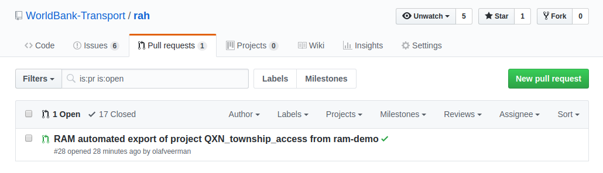
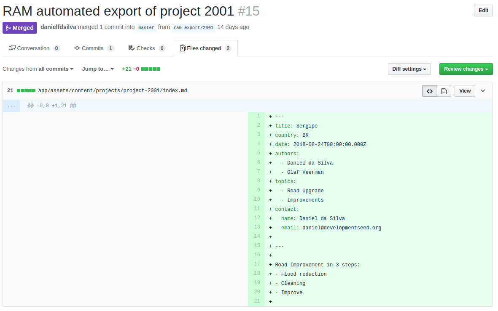
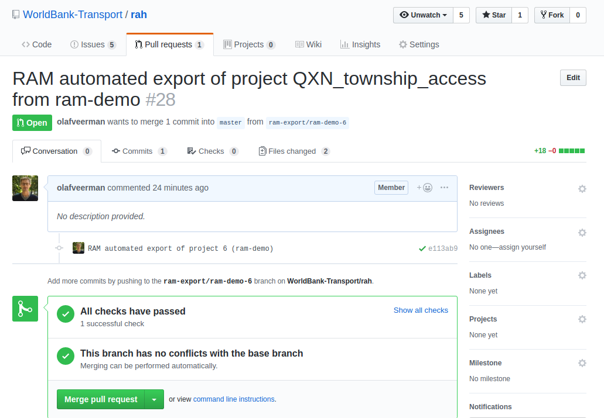
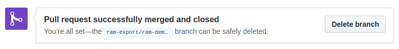

# Publishing new content
When somebody exports data from RAM, [a new Pull Request](https://github.com/WorldBank-Transport/rah/pulls) will show up in the issue queue.

Users that belong to the [RAH moderators](https://github.com/orgs/WorldBank-Transport/teams/rah-moderators/members) team on Github will receive a notification by email when a PR is created, unless they actively chose to disable notification.

## 1. Review changes
To view the content that was submitted by the person, check the tab 'Files changed'

## 2. Merge Pull Request
When the project is ready to be published, choose to 'Merge pull request'. Once you hit the button, it should take a couple of minutes for the project to appear on the RAH.

If the case study shouldn't be published on RAH, choose to 'Close pull request' instead.

## 3. Delete branch
Once the pull request is either merged or closed, don't forget to 'Delete branch'. 

