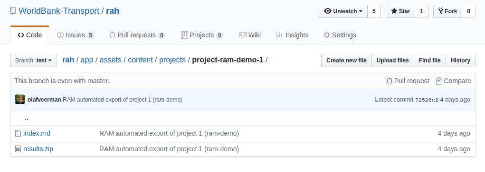
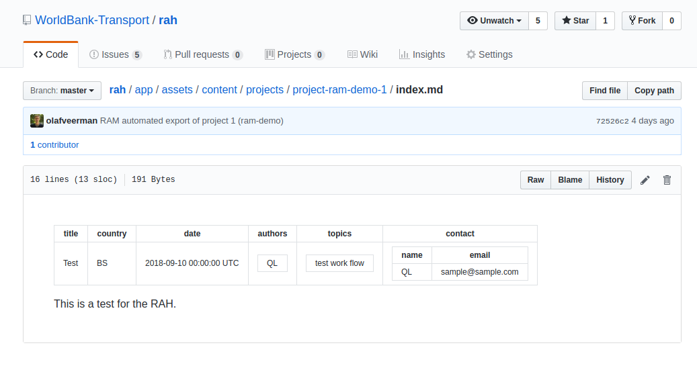
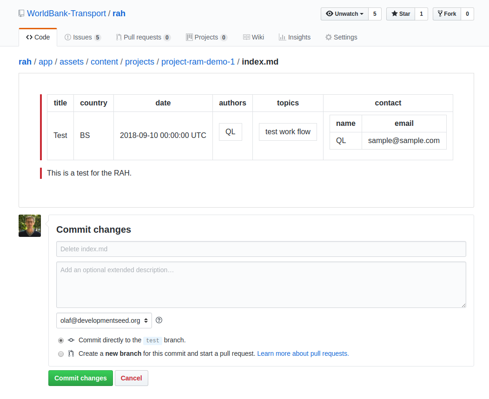

# Removing content
Removing existing content requires the deletion of all files of a particular project.

## 1. Go to project folder
On Github, go to the appropriate project folder https://github.com/WorldBank-Transport/rah/tree/master/app/assets/content/projects

## 2. Delete files
Each of the files will have to be deleted separately. Click on the first file, and then on the delete button.

Choose to commit changes.

Repeat this for all files in the project folder. Once all files are deleted, the project folder will be removed as well.
